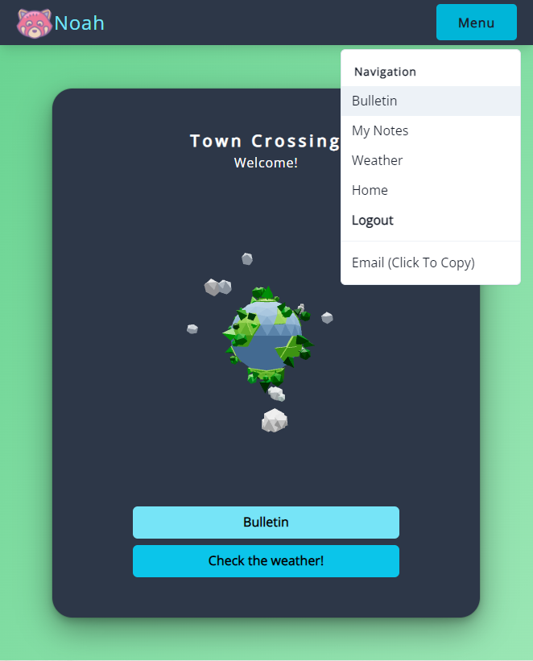

# Introduction


Welcome to Town Crossing!

Sign up, post a Note to the Bulletin, and check the weather... Stay a while!
(https://www.towncrossing.dev)


## Index

- [About](#about)
- [Usage](#usage)
  - [Installation](#installation)
  - [Commands](#commands)
- [Reflection](#reflection)
- [Project Screen Shots](#project-screenshots)

## About

Town Crossing is a social media platform where you can connect with your friends. The application was developed using primarily TypeScript, ReactJS, NodeJS, Mongoose, and Express.

The application includes several different features, such as:

- Functional backend database via MongoDB Atlas
- Authentication and authorization via JSON Web Tokens (JWT)
- State management via Redux
- Form control and validation via Formik and Yup
- UI Designed with Chakra-UI and Framer Motion
- Fetching API with Axios
- ThreeJS Model, created with Blender and implemented with React-Three-Fiber

## Usage

Want to install locally?

### Installation

- Clone this repository. You will need NPM and NODE on your device.
- After cloning, install the necessary packages via:

```
$ npm install
```

### Commands

- After installation, run the following command to get start!
- The project will be viewable on http://localhost:3000/

```
$ npm start
```

## Reflection

Reflection...

## Project Screenshots



